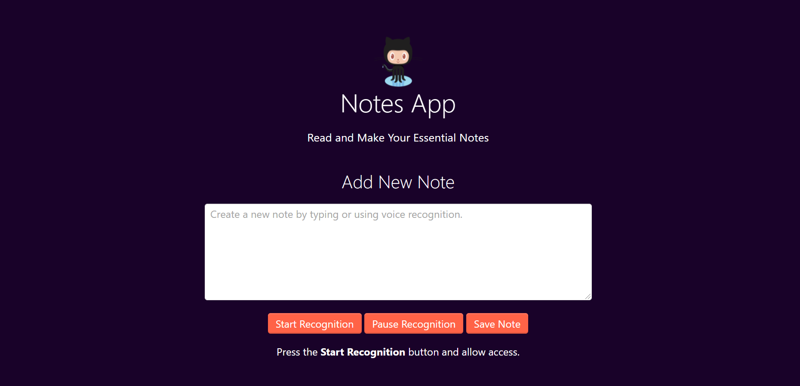

## Voice Notes 

**What is This ?**
 

"This is an simple Vanilla JavaScript App which is working on SpeechSynthesisUtterance".
"SpeechSynthesisUtterance : A Web Speech API interface represents a speech request. It contains the content the speech service should read and information about how to read it (e.g. language, pitch and volume.)"

